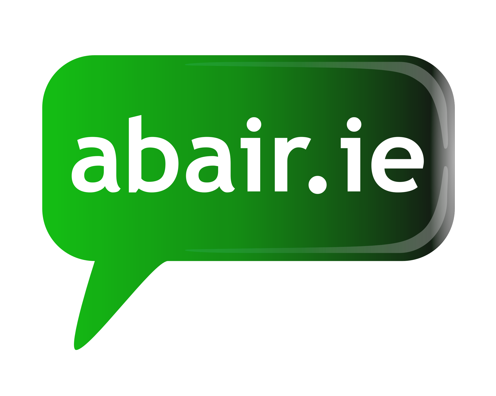

## Irish Language Chrome Extension using ABAIR
This is based off the chrome extension build by dabit3 here: https://github.com/dabit3/transilator

### Features

- Turns highlighted text into lifelike speech

### Applications
- Learning a new language
- Listening to a news article, documentation, or blog post
- Reviewing a blog post / tweet before publishing it
- Users with vision problems / accessibility related use cases
- Listening to emails
- Listening to content from other languages


### Services used

This app uses ABAIR for voice synthesization of the text.

## Getting started

1. Clone the project and install the dependencies:

```sh
git clone https://github.com/OisinThomasMorrin/IrishChromeSynthesiser.git

cd IrishChromeSynthesiser

npm install
```

2. Build the bundle

```sh
npm run build
```

3. Upload the extension to chrome

- Visit chrome://extensions (menu -> settings -> Extensions).
- Enable Developer mode by ticking the checkbox in the upper-right corner.
- Click on the "Load unpacked extension..." button.
- Select the directory containing your unpacked extension.

There are issues if you have another extension with a popup active. 
